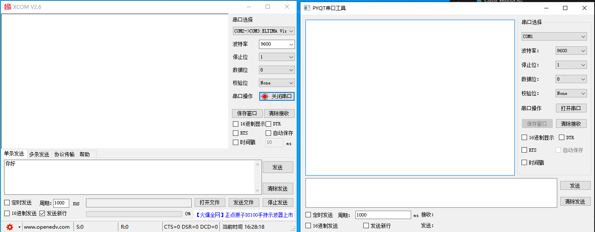

创建环境 
conda create -n test python=3.6

查看环境
conda env list

激活虚拟环境的命令是
conda activate your_env_name

退出以及删除虚拟环境
删除当前虚拟环境的命令是：
conda deactivate

删除虚拟环境的命令是：
conda remove -n  your_env_name --all

如果我们想要删除刚创建的 test 虚拟环境，只需要输入：
conda remove -n test --all
关于更多的 conda 创建虚拟环境的命令，可以通过命令：
conda create -h

在使用 pip 安装 Python 包时，可以通过指定镜像源来加快下载速度。以下是两种常用的方法：

临时指定镜像源

可以在安装包时临时指定镜像源，例如使用清华大学的镜像源：

pip install numpy -i https://pypi.tuna.tsinghua.edu.cn/simple
永久指定镜像源

通过修改配置文件，可以永久指定镜像源。对于 Linux 或 MacOS 系统，可以在用户目录下创建或修改 ~/.pip/pip.conf 文件：

mkdir ~/.pip
然后在 pip.conf 文件中添加以下内容：

[global]
index-url = https://pypi.tuna.tsinghua.edu.cn/simple

[install]
trusted-host = pypi.tuna.tsinghua.edu.cn
对于 Windows 系统，可以在用户目录下创建或修改 C:\Users\<用户名>\pip\pip.ini 文件，内容同上
1
2
。
-i https://pypi.tuna.tsinghua.edu.cn/simple

D:\ProgramData\anaconda3\envs\pyqt_env\Scripts\pyuic5.exe
D:\ProgramData\anaconda3\envs\pyqt_env\Lib\site-packages\qt5_applications\Qt\bin\designer.exe

https://www.runoob.com/vscode/vscode-windows-install.html

# 串口工具 

参考链接 
【pyqt串口合集】 https://www.bilibili.com/video/BV15R4y1s7JD/?p=9&share_source=copy_web&vd_source=9d8f33227e43b7e7beef9eeeb2a1d8b7
## 我的问题 
中文显示 没有优化好会乱码

